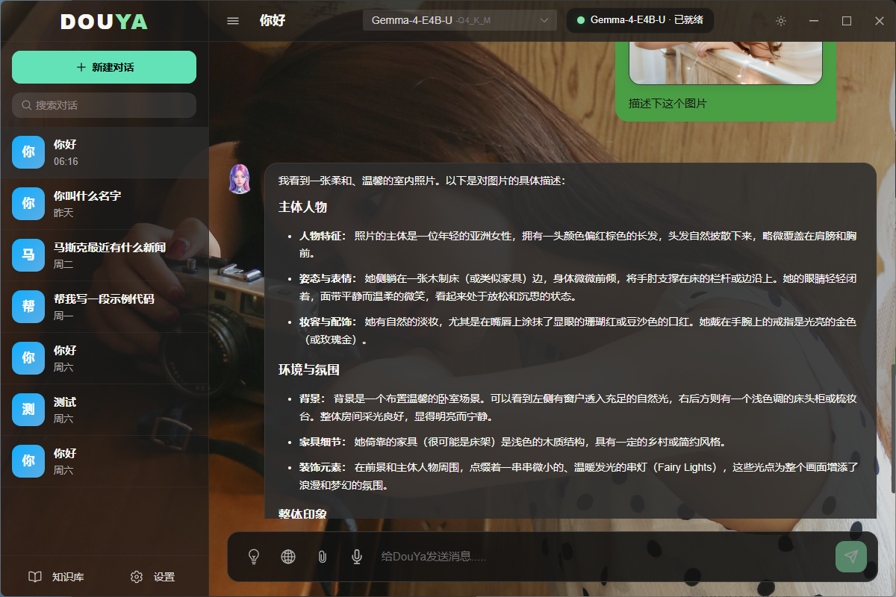

# 豆芽 Douya — 本地 AI 桌面助手

<p align="center">
  <strong>隐私优先 · 完全离线 · GPU 加速 · 多模态对话 · 外部工具接入</strong>
</p>

<p align="center">
  
</p>

豆芽是一款基于 [llama.cpp](https://github.com/ggml-org/llama.cpp) 的本地大语言模型桌面客户端。所有推理在本地完成，无需联网、数据不出本机，真正守护你的隐私。同时原生提供 OpenAI 兼容 API，可作为本地推理后端接入 Claude Code、Codex、OpenCoder 等外部编程工具。

---

## ✨ 核心特性

### 🧠 本地推理引擎
- 基于 **llama.cpp server**（Router 模式），支持 **CUDA GPU 加速**
- **智能硬件检测**：自动识别 GPU 型号与 VRAM 容量，计算最优的 GPU 层数、线程数、KV Cache 策略
- **GGUF 元数据解析**：读取模型架构信息（block_count、embedding_length、chat_template 等），按模型规模分级调优
- **Flash Attention**、**KV Cache 量化**（Q4_0 / Q8_0）、**mlock** 等高级优化一键开启
- **投机解码**（Speculative Decoding）：支持草稿模型加速推理
- **DRY 采样器**：抑制重复短语，提升生成质量
- **mmproj GPU 卸载**：多模态投影模型自动走 GPU，Router 模式下通过 `router-preset.ini` 全局生效

### 🔄 智能模型管理
- **多模型切换**：利用 Router 的 LRU 自动卸载机制，切换模型时无需手动卸载旧模型
- **Sleep-Idle 休眠**：模型空闲后自动释放 VRAM，新请求到达时自动唤醒
- **模型热重载**：支持 `GET /models?reload` 热更新模型列表，无需重启服务
- **模型状态可视化**：实时显示 `loaded` / `loading` / `sleeping` / `unloaded` 状态
- **多模态能力预检测**：扫描 GGUF 元数据中的 `clip.has_vision_encoder` / `clip.has_audio_encoder`，加载前即知模型能力
- **思考模式检测**：三级优先级（`/props supports_preserve_reasoning` > GGUF Architecture > 文件名关键词），自动识别 Qwen3 / Gemma / DeepSeek 等思考模型

### 💬 智能对话
- **流式输出（SSE）**：实时逐字显示 AI 回复，打字机般的体验
- **多轮对话管理**：创建、重命名、删除、搜索对话记录
- **消息级联删除**：删除用户消息时自动清理关联的 AI 回复
- **重新生成**：对任意用户消息重新生成 AI 回答
- **对话导出**：支持将对话导出为文件
- **推理模型支持**：DeepSeek-R1 / QwQ 等思考链模型的推理过程可折叠显示
- **系统提示词**：自定义 AI 行为，支持日期变量注入
- **停止生成**：随时中断 AI 的回复生成，已生成内容自动保存
- **上下文溢出三层防御**：预防性裁剪 + 全量估算 + 错误后重试

### 🖼️ 多模态输入
- **图片输入**：支持 Gemma、LLaVA 等视觉模型，可粘贴或上传图片
- **音频输入**：支持音频多模态模型（如 Gemma 4 audio）
- **PDF 文档**：使用 `ledongthuc/pdf` 库提取 PDF 文本，正则回退兜底
- **文本文件**：直接读取 `.txt` / `.md` 等文本文件内容
- **智能附件过滤**：根据模型实际加载的 mmproj 能力，自动启用或禁用对应的附件类型
- **附件 Token 精确估算**：图片 3500 tokens，避免上下文溢出

### 🔍 联网搜索
- **三态开关**：`off`（不搜索）/ `auto`（智能搜索）/ `on`（强制搜索）
  - `auto` 模式下：支持 Tool Call 的模型自主决定是否搜索；不支持的模型预搜索 + 注入结果
- **步降式搜索链**：Tavily → Ollama → 360 搜索 → Bing，按顺序尝试，收集到足够结果即停止（不并发）
- **中文查询优化**：中文关键词加双引号强制精确匹配；DuckDuckGo 加 `kl=cn-zh`、Bing 加 `cc=cn&setlang=zh-Hans`
- **结果自然融入**：搜索结果以 XML 标签格式注入，系统提示词要求 AI 自然融入回答，不使用 `[1][2]` 编号引用
- **RAG 互斥**：RAG 开启时自动关闭联网搜索，避免上下文污染

### 📚 RAG 知识库
- 基于 **BadgerDB** 的本地向量存储（HNSW 索引）
- **混合检索**：向量相似度 + BM25 关键词检索
- 支持文档导入、自动分块、向量化
- 使用本地 LLM 生成 Embedding，完全离线
- **独立 Embedding 模型配置**：可配置专用 Embedding 模型，否则跟随聊天模型
- **维度自动适配**：RAG 向量集合维度为 0 时自动更新为实际 Embedding 维度
- 可创建多个知识库，自由切换启用
- 支持 `.pdf`、`.txt`、`.md` 等多种文档格式
- **并发安全**：独立 `ragMu` 读写锁保护，避免竞态条件
- **上下文隔离**：RAG 检索结果作为独立 system 消息注入，不污染原 system prompt

### 🔌 外部工具接入
- **OpenAI 兼容 API**：豆芽原生暴露 llama-server 的 `/v1/chat/completions`、`/v1/embeddings` 等端点
- **暴露服务器地址开关**：GUI 一键切换
  - 开启：绑定 `0.0.0.0`，局域网设备可访问
  - 关闭：绑定 `127.0.0.1`，仅本机访问
- **API Key 认证**：通过 `Authorization: Bearer <key>` 鉴权
- **已验证接入**：Claude Code、Codex (OpenAI CLI)、OpenCoder / Open Claw、通用 OpenAI 兼容客户端
- 详见 [docs/external-tools-access.md](docs/external-tools-access.md)

### 🎤 语音输入
- 基于 **Web Speech API** 的语音识别
- 实时显示中间识别结果
- 随时开始 / 停止录音

### 🎨 个性化定制
- **深色 / 浅色主题**：一键切换
- **自定义聊天背景**：支持本地图片，可调节透明度
- **自定义头像**：用户头像、AI 助手头像均可替换
- **生成参数调节**：Temperature、Top-P、Top-K、Min-P、Repeat Penalty 等
- **推理参数控制**：Reasoning 模式（auto / on / off）、Reasoning Budget、Reasoning Format
- **上下文移位**（Context Shift）：长对话智能截断保留关键信息

### 🪟 桌面体验
- **无边框窗口**：自定义标题栏，简洁现代
- **系统托盘**：最小化到托盘，后台静默运行
- **单实例保护**：重复启动时自动激活已有窗口
- **优雅退出**：关闭窗口时自动停止模型服务，释放 GPU 资源
- **链接外开**：所有 `http://` / `https://` 链接通过系统默认浏览器打开，防止 Webview 内部导航

### 🔒 安全加固
- **API Key 加密存储**：AES-GCM 加密，`enc:` 前缀标识
- **文件路径校验**：`filepath.Clean` + `..` 检测 + 扩展名白名单
- **上传文件校验**：扩展名白名单 + MIME 类型校验 + 200MB 大小限制
- **API Key 防暴露**：前端仅返回设置状态，不返回实际 Key 值
- **搜索结果 XML 转义**：防止注入攻击
- **XSS 防护**：前端 Markdown 渲染使用 `lightSanitize` 轻量消毒

---

## 🛠️ 技术栈

| 层级 | 技术 |
|------|------|
| 桌面框架 | Go 1.25 + [Wails v2](https://wails.io/) |
| 前端 | Vue 3 + TypeScript + [Naive UI](https://www.naiveui.com/) + Pinia |
| 推理引擎 | [llama.cpp](https://github.com/ggml-org/llama.cpp)（CUDA, Router 模式） |
| 向量存储 | [BadgerDB v4](https://github.com/dgraph-io/badger)（HNSW 索引） |
| 数据库 | SQLite3 |
| PDF 解析 | [ledongthuc/pdf](https://github.com/ledongthuc/pdf) |
| 日志 | [zerolog](https://github.com/rs/zerolog) |
| 系统托盘 | [systray](https://github.com/fyne-io/systray) |
| 构建工具 | Vite + vue-tsc |

---

## 📁 项目结构

```
douya/
├── main.go                  # 应用入口：Wails 初始化、单实例保护、系统托盘
├── app.go                   # 核心逻辑：模型切换、服务管理、Wails 绑定方法
├── build.ps1                # Windows 构建脚本（生成 release/ 发布包）
├── internal/
│   ├── chat/                # 对话服务：消息构建、流式生成、搜索集成、RAG、PDF 解析
│   ├── config/              # 配置管理：JSON 持久化、参数验证（Validate）
│   ├── httputil/            # HTTP 工具：完整请求体读取（io.ReadAll）
│   ├── llm/                 # LLM 控制层
│   │   ├── client.go        # HTTP 客户端：流式聊天、Embedding、模型加载/卸载/重载
│   │   ├── server.go        # llama-server 进程管理、健康检查、自动重启
│   │   ├── preset.go        # 模型扫描、GGUF mmproj 能力检测、INI 生成
│   │   ├── types.go         # 数据类型：ModelCapabilities、ServerStatus
│   │   ├── vram.go          # VRAM 释放检测（nvidia-smi）
│   │   └── ringbuffer.go    # 环形缓冲区：高效处理流式响应
│   ├── pdfutil/             # PDF 文本提取（带正则回退）
│   ├── rag/                 # RAG 知识库
│   │   ├── vector_store.go  # 向量存储（BadgerDB + HNSW）
│   │   ├── document_store.go     # 文档元数据管理
│   │   ├── document_pipeline.go  # 文档分块与向量化流水线
│   │   ├── bm25.go          # BM25 关键词检索
│   │   ├── file_parser.go   # 文件解析器
│   │   └── embedder_adapter.go   # Embedding 模型适配
│   ├── search/              # 搜索引擎：Tavily / Ollama / 360 / Bing（步降式）
│   ├── secrets/             # AES-GCM 加密：API Key 安全存储
│   ├── store/               # SQLite 存储：对话、消息 CRUD、设置持久化
│   ├── system/              # 硬件检测、GGUF 元数据解析、智能参数计算
│   └── logger/              # 日志配置
├── frontend/
│   └── src/
│       ├── App.vue          # 根组件：模型选择器、服务状态、主题切换
│       ├── components/
│       │   ├── ChatView.vue      # 聊天主视图
│       │   ├── ChatInput.vue     # 输入框：文本、附件、语音、搜索三态开关
│       │   ├── MessageList.vue   # 消息列表（MutationObserver + RAF 滚动控制）
│       │   ├── MessageItem.vue   # 消息卡片：Markdown 渲染、操作菜单
│       │   ├── ThinkBlock.vue    # 推理过程折叠展示
│       │   ├── Sidebar.vue       # 侧边栏：对话列表、知识库入口
│       │   └── SearchStatus.vue  # 搜索状态指示
│       ├── views/
│       │   ├── SettingsView.vue   # 设置页面（含暴露服务器地址开关）
│       │   └── KnowledgeView.vue  # 知识库管理页面
│       ├── stores/          # Pinia 状态管理：chat、settings、theme
│       ├── services/        # Wails 绑定层
│       └── utils/           # Markdown 渲染、UTF-8 修复、模型名格式化、轻量消毒
├── docs/
│   └── external-tools-access.md  # 外部编程工具接入文档
├── cmd/
│   └── test_api/            # API 测试命令行工具
├── tests/                   # 测试用例（含 -race 竞态检测）
│   ├── chat/                # 对话功能测试（功能、交互、质量、架构、注入保护等）
│   ├── llm/                 # LLM 模块测试
│   ├── search/              # 搜索引擎测试
│   ├── store/               # 存储层测试
│   └── config/              # 配置模块测试
├── assets/                  # 项目资源
│   └── GUI.png              # 程序界面展示图
├── models/                  # GGUF 模型文件（gitignore）
└── runtime/                 # llama-server.exe + CUDA 运行时库（gitignore）
```

---

## 🚀 快速开始

### 下载发布包

前往 [Releases](https://github.com/zifeiyu2025/douya/releases) 下载最新版本的 `Douya-vX.X.X.zip`，解压后即可使用，无需安装。

### 从源码构建

#### 环境要求

- **Go** 1.25+
- **Node.js** 18+
- **CUDA** 12+（GPU 加速，可选）
- **Windows** 10 / 11
- **NVIDIA GPU**（推荐，VRAM ≥ 6GB）
- **Wails CLI**：`go install github.com/wailsapp/wails/v2/cmd/wails@latest`

#### 开发模式

```bash
# 1. 安装前端依赖
cd frontend && npm install && cd ..

# 2. 启动开发模式
wails dev
```

#### 生产构建

```powershell
# 一键构建发布包（前端 + Wails + 同步依赖）
.\build.ps1
```

构建产物位于 `release/` 目录，结构如下：

```
release/
├── bin/
│   └── Douya.exe           # 主程序
├── data/                   # 数据目录（运行时自动创建数据库）
├── docs/                   # 文档
├── models/                 # GGUF 模型文件（需自行放入）
└── runtime/                # llama-server.exe + CUDA DLL
```

> **注意**：`build.ps1` 会优先使用 `D:\Program Files\GoTools\bin\wails.exe`，找不到时回退到 `$GOPATH/bin/wails.exe`。脚本包含 UTF-8 BOM 以兼容 PowerShell 5.1。

---

## 📦 发布包使用说明

### 目录结构（data 与 bin 同级）

```
Douya-vX.X.X/
├── bin/
│   └── Douya.exe           # 主程序（双击运行）
├── data/                   # 数据目录（自动创建）
│   ├── douya.db            # SQLite 数据库（聊天记录、配置）
│   ├── .enc_key            # API Key 加密密钥（请勿删除）
│   └── rag/                # RAG 向量索引
├── docs/
│   └── external-tools-access.md  # 外部工具接入文档
├── models/                 # 模型文件目录（需自行放入 GGUF）
│   ├── gemma-4b/
│   │   ├── gemma-4b.Q4_K_M.gguf
│   │   └── mmproj-gemma-4b.gguf   # 多模态投影（可选）
│   └── qwen-7b.Q4_K_M.gguf        # 单文件模型也支持
└── runtime/                # 运行时依赖
    ├── llama-server.exe    # llama.cpp 服务端
    ├── ggml-cuda.dll       # CUDA 加速库
    ├── cublas64_13.dll
    └── ...
```

### 首次使用

1. 解压 zip 到任意目录
2. 将 GGUF 模型文件放入 `models/` 目录
3. 运行 `bin/Douya.exe`
4. 程序会在 `data/` 目录自动创建数据库和配置

### 接入外部编程工具

1. 在「设置 → 服务 API KEY」中开启「暴露服务器地址」
2. 设置 API Key（防止未授权访问）
3. 重启服务使配置生效
4. 参阅 [docs/external-tools-access.md](docs/external-tools-access.md) 配置 Claude Code、Codex 等工具

接入三要素：
- **Base URL**：`http://<豆芽所在机器IP>:8080/v1`
- **API Key**：在豆芽设置中配置的 Key
- **Model**：默认模型或指定模型名

---

## ⚙️ 配置说明

配置文件 `config.json` 在 `data/` 目录自动生成，加载时自动调用 `Validate()` 校验，失败回退默认配置。主要配置项：

### 模型与推理

| 配置项 | 说明 | 默认值 |
|--------|------|--------|
| `model_path` | 默认模型路径 | （空） |
| `context_size` | 上下文窗口大小 | `8192` |
| `port` | llama-server 端口 | `8080` |
| `expose_server` | 暴露服务器地址（局域网访问） | `false` |
| `mmproj_auto` | 自动检测 mmproj | `true` |
| `mmproj_offload` | mmproj GPU 卸载 | `true` |
| `sleep_idle_seconds` | 模型空闲休眠超时（秒） | `120` |
| `models_max` | 最大并行模型数 | `1` |

### 生成参数

| 配置项 | 说明 | 默认值 |
|--------|------|--------|
| `temperature` | 生成温度（越高越随机） | `0.6` |
| `top_p` | 核采样阈值 | `0.95` |
| `top_k` | Top-K 采样 | `20` |
| `min_p` | 最小概率阈值 | `0.05` |
| `repeat_penalty` | 重复惩罚系数 | `1.1` |
| `dry_multiplier` | DRY 采样器强度 | `0.0` |
| `dry_base` | DRY 采样器基准 | `1.75` |
| `dry_allowed_length` | DRY 允许的重复长度 | `2` |

### 推理控制

| 配置项 | 说明 | 默认值 |
|--------|------|--------|
| `reasoning` | 推理模式（auto / on / off） | `"auto"` |
| `reasoning_budget` | 推理 Token 预算 | `0` |
| `reasoning_format` | 推理输出格式 | （空） |
| `thinking_enabled` | 思考过程开关 | `true` |

### 高级优化

| 配置项 | 说明 | 默认值 |
|--------|------|--------|
| `kv_unified` | 统一 KV Cache | `false` |
| `kv_offload` | KV Cache GPU 卸载 | `false` |
| `cache_type_k` / `cache_type_v` | KV Cache 量化类型 | `"f16"` |
| `spec_type` | 投机解码草稿模型类型 | （空） |
| `spec_draft_n_max` | 草稿 Token 数量 | `0` |
| `context_shift` | 上下文移位开关 | `true` |
| `mmap` | 内存映射加载 | `true` |

### 搜索与 RAG

| 配置项 | 说明 | 默认值 |
|--------|------|--------|
| `search_mode` | 搜索模式（off / auto / on） | `"off"` |
| `rag_enabled` | RAG 知识库开关 | `false` |
| `rag_top_k` | 知识库召回数量 | `3` |
| `rag_min_score` | 召回最低相似度 | `0.3` |
| `rag_chunk_size` | 文档分块大小 | `512` |
| `rag_chunk_overlap` | 分块重叠大小 | `64` |

### 个性化

| 配置项 | 说明 | 默认值 |
|--------|------|--------|
| `system_prompt` | 自定义系统提示词 | （空） |
| `system_prompt_mode` | 提示词模式（append / replace） | `"append"` |
| `chat_background` | 聊天背景图片路径 | （空） |
| `chat_background_opacity` | 背景图片透明度 | `0.1` |
| `user_avatar` | 用户头像路径 | （空） |
| `ai_avatar` | AI 头像路径 | （空） |

---

## 🏗️ 架构亮点

### Router 模式模型切换

豆芽使用 llama.cpp 的 Router 模式管理模型生命周期，切换流畅无需手动干预：

```
用户切换模型 → SwitchModel(newModel)
                    ↓
    Router 内部 LRU 自动卸载最久未用的模型
                    ↓
    启动新子进程加载模型
                    ↓
    WaitForModelLoaded → 新模型就绪
```

- 无需手动 `UnloadModel` + 等待 VRAM 释放
- LRU 策略自动管理 GPU 显存
- Sleep-Idle 机制：空闲模型自动休眠释放 VRAM，新请求自动唤醒
- 启动时加 `--no-models-autoload` 避免与显式 `/models/load` 冲突

### 智能参数计算

根据 GPU VRAM 和模型规模自动计算最优参数：

1. 解析 **GGUF 元数据**，获取模型架构参数（block_count、embedding_length、chat_template 等）
2. 估算模型规模等级：`Tiny` → `Small` → `Medium` → `Large` → `XL`
3. 结合 GPU VRAM 容量，自动计算 GPU 层数、KV Cache 量化类型、Flash Attention 策略等
4. 智能缓存类型推荐：VRAM/模型 ≤0.7 → q8_0/q4_0；0.7~1.5 → q8_0/turbo3；>1.5 → turbo3/turbo2

### 多模态能力检测

三层递进式能力检测，确保准确性：

1. **GGUF 预扫描**：读取 mmproj 文件的 `clip.has_vision_encoder` / `clip.has_audio_encoder`
2. **/v1/models 端点**：获取模型自身声明的 `input_modalities`
3. **/props 端点**：获取 mmproj 实际加载后的可用 modalities（**最终依据**）

### 思考模式检测

三级优先级判断模型是否支持思考开关：

1. **`/props supports_preserve_reasoning`**（最高）：服务端能力声明
2. **GGUF Architecture 字段**（中）：`qwen3` → template+soft_switch；`gemma2/gemma4/llama4/phi4` → template；`deepseek3/deepseek2` → reasoning
3. **文件名关键词**（最低）：`gemma-2` / `qwq` / `mistral-small3.1` / `phi-4-reasoning-plus` 等

### Tool Call 支持检测

基于 GGUF 元数据的 `chat_template_tool_use` 字段判断模型是否支持工具调用，替代传统的弱模型白名单判断。

### 会话异常恢复

启动时自动扫描数据库中的异常对话状态，清理「用户消息已发送但没有 AI 回复」的不完整对话，保证对话列表的一致性。

### 搜索结果注入流程

```
用户消息 → 检测 search_mode
              ↓
         off → 直接调用 LLM
              ↓
         auto → 强模型：LLM(tool_call) → 搜索 → 结果返回 → LLM 再回答
              ↓      弱模型：预搜索 → 注入 system → LLM 回答
         on  → 所有消息强制搜索 → 注入 → LLM 回答
```

搜索结果以 `<search_results><result>...</result></search_results>` XML 标签格式注入，系统提示词要求 AI 自然融入回答，不使用 `[1][2]` 编号引用。

---

## 🧪 测试

项目采用测试驱动开发（TDD），关键模块均有测试覆盖：

```bash
# 运行所有测试（含竞态检测）
go test ./... -race

# 运行特定模块测试
go test ./tests/chat/ -race
go test ./tests/config/ -race
go test ./internal/rag/ -race

# 前端测试
cd frontend && npm test
```

测试覆盖范围：
- **对话功能**：功能、交互、质量、架构、注入保护、数据竞态、停止保存
- **配置模块**：Validate 校验、DefaultConfig、Load 容错
- **LLM 模块**：客户端、预设、能力检测、环形缓冲区、服务端
- **RAG 模块**：向量存储、文档管道、BM25、端到端
- **搜索模块**：链式降级、Provider 接口
- **前端**：Markdown 渲染、流式渲染、滚动控制、状态管理

---

## 📋 平台支持

- **当前平台**：仅支持 Windows 10 / 11
- **运行时稳定性**：已优先保证，暂不考虑生态


---

## 📄 许可证

[MIT](LICENSE)
